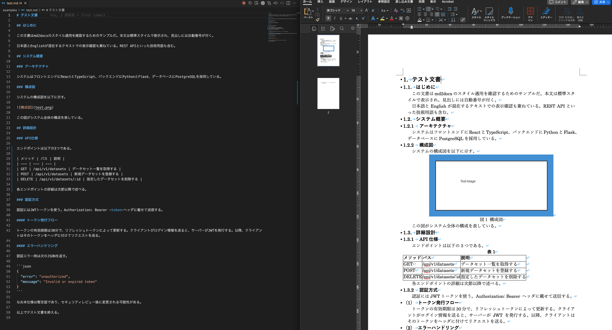

# md2docx

MarkdownファイルをWord(.docx)に変換するCLIツール。



## 対応するMarkdown要素

| 要素             | 記法                | 変換時の処理                              |
| ---------------- | ------------------- | ----------------------------------------- |
| 見出し           | `# H1` ～ `#### H4` | 自動採番付き（1, 1.1, 1.1.1, (1), ①）     |
| 段落             | 通常のテキスト      | 字下げ・余白をtwip単位で制御              |
| 箇条書き         | `- item`            | ネスト対応、行頭文字カスタマイズ可（●■▲） |
| 番号付きリスト   | `1. item`           | ネスト対応、開始番号指定可                |
| 表               | GFM形式             | 自動で「表1」「表2」と採番                |
| 画像             | ``      | 自動で「図1」「図2」と採番、形式自動変換  |
| コードブロック   | ` ``` `             | Courier New / MS ゴシック、9pt            |
| 水平線           | `---`               | 空段落に変換                              |
| 太字             | `**text**`          | 対応                                      |
| 斜体             | `*text*`            | 対応                                      |
| インラインコード | `` `code` ``        | 「」で囲んで表示                          |
| リンク           | `[text](url)`       | ハイパーリンク化、アンカーリンクにも対応  |

## pandocとの違い

pandocは汎用の文書変換ツールだが、md2docxは日本語のWord文書を作ることに特化している。

- **日本語フォントがデフォルト**。本文は游明朝、見出しは游ゴシック。英語フォントも別途指定でき、混植が自然になる。
- **見出しの自動採番**。H1からH5まで階層的に番号を振る（1 → 1.1 → 1.1.1 → (1) → ①）。既存の番号があれば重複を避ける。
- **表・画像の自動採番**。WordのSEQフィールドを使い「表1」「図1」と振る。文書内で番号が自動更新される。
- **TOML設定ファイル一つで制御**。フォント、サイズ、インデント、行頭文字をまとめて指定できる。pandocのようにテンプレートdocxを用意する必要がない。
- **英日間スペースの自動削除**。日本語と英語の境界にある不要なスペースを消して、組版を整える。
- **シングルバイナリ**。Rustで書かれておりLaTeXやPython環境が不要。`cargo install`だけで使える。

## インストール

Rust 1.70以上が必要。

コマンドとしてインストールする場合は以下を実行する。

```sh
cargo install --path .
```

$HOME/.cargo/bin/md2docxにバイナリが入る。PATHが通っていなければ、~/.zshrcなどに次の行を足す。

```sh
export PATH="$HOME/.cargo/bin:$PATH"
```

ビルドだけしたい場合はこちら。

```sh
cargo build --release
```

バイナリはtarget/release/md2docxに生成される。

## 使い方

```sh
md2docx <入力ファイル> [オプション]
```

md2docx --helpで詳細を確認できる。

| オプション      | 説明                                                                              |
| --------------- | --------------------------------------------------------------------------------- |
| `-o, --output`  | 出力先を指定する。省略すると入力ファイル名の拡張子を `.docx` に変えたものになる。 |
| `-c, --config`  | 設定ファイル (TOML) を指定する。省略するとデフォルト設定が使われる。              |
| `-h, --help`    | ヘルプを表示する。`--help` なら設定ファイルの書式も出る。                         |
| `-V, --version` | バージョンを確認する。                                                            |

```sh
# 基本的な変換（document.docxが生成される）
md2docx document.md

# 出力先を指定
md2docx document.md -o output.docx

# 設定ファイルを指定
md2docx document.md -o output.docx -c md2docx.toml
```

## 設定ファイル

TOML形式でフォントやサイズをカスタマイズできる。すべての項目は省略可能で、省略した項目にはデフォルト値が入る。全項目とデフォルト値はmd2docx --helpで確認できる。

```toml
[fonts]
body_ja = "游明朝"
body_en = "Century"
heading_ja = "游ゴシック"
heading_en = "Century"

[sizes]
body = 10.5
heading1 = 14.0
heading2 = 12.0
heading3 = 11.0
heading4 = 11.0

[indent]
body_left = 210
body_first_line = 210
body_right = 210
body_left_chars = 100
heading4_left = 709
heading4_hanging = 709

[bullet]
level0 = "●"
level1 = "■"
level2 = "▲"
```

fontsセクションでは本文と見出しそれぞれの日本語フォント、英語フォントを指定する。sizesセクションで本文と各レベルの見出しのフォントサイズをpt単位で設定する。

indentセクションのtwipはWordの内部単位で、1twipは1/20pt。210twipがおおむね全角1文字分にあたる。body_left_charsはWord独自の文字数単位で、100が1文字に相当する。

bulletセクションで箇条書きの各レベルに使う行頭文字を変更できる。

## 対応するMarkdown要素

見出しはH1からH4まで対応しており、自動採番が付く。段落、箇条書き、番号付きリストはネストにも対応する。表には自動で表番号が振られ、画像には図番号が付く。コードブロックと水平線にも対応している。インライン要素としてはテキスト、コード、太字、斜体、リンクを扱える。
