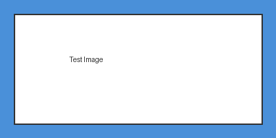

# テスト文書

## はじめに

この文書はmd2docxのスタイル適用を確認するためのサンプルだ。本文は標準スタイルで表示され、見出しには自動番号が付く。

日本語とEnglishが混在するテキストでの表示確認も兼ねている。REST APIといった技術用語も含む。

## システム概要

### アーキテクチャ

システムはフロントエンドにReactとTypeScript、バックエンドにPythonとFlask、データベースにPostgreSQLを採用している。

### 構成図

システムの構成図を以下に示す。



この図がシステム全体の構成を表している。

## 詳細設計

### API仕様

エンドポイントは3つある。GETメソッドの/api/v1/datasetsでデータセット一覧を取得し、同じパスへのPOSTで登録する。/api/v1/datasets/:idに対するDELETEで個別のデータセットを削除できる。

### 認証方式

認証にはJWTトークンを使う。Authorization: Bearer <token>ヘッダに載せて送信する。

#### トークン発行フロー

トークンの有効期限は30分で、リフレッシュトークンによって更新する。クライアントがログイン情報を送ると、サーバーがJWTを発行する。以降、クライアントはそのトークンをヘッダに付けてリクエストを送る。

#### エラーハンドリング

認証エラー時は次のJSONを返す。

```json
{
  "error": "unauthorized",
  "message": "Invalid or expired token"
}
```

なお本仕様は暫定版であり、セキュリティレビュー後に変更される可能性がある。

以上でテスト文書を終える。
